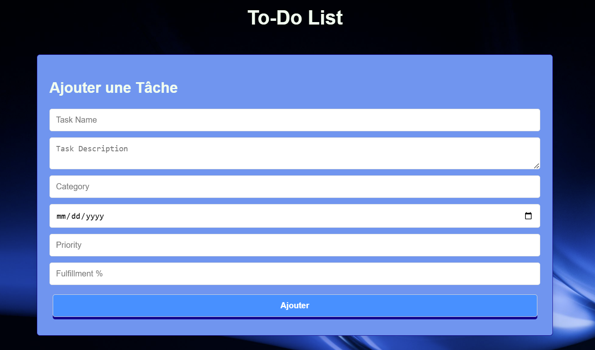
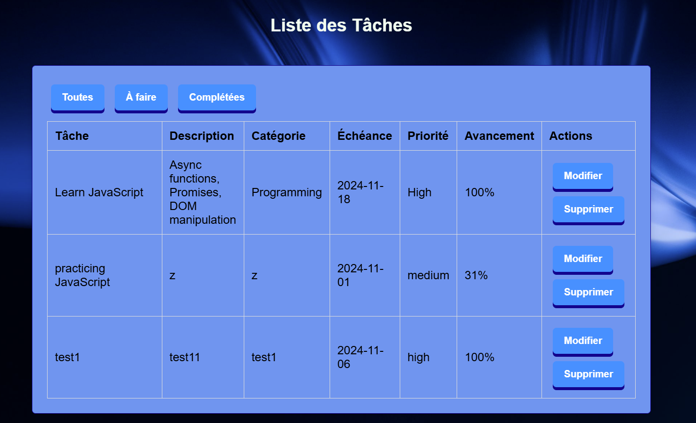

# **To-Do List App**

An interactive and user-friendly To-Do List application built with HTML, CSS, and JavaScript, using JSON Server to simulate a backend. This project showcases essential CRUD operations and dynamic DOM manipulation, offering a comprehensive solution for task management.

---

## **Features**

- **Add Tasks:** Create new tasks with details such as title, description, category, due date, priority, and progress percentage.
- **View Tasks:** Display tasks in an organized table format with all the associated details.
- **Edit Tasks:** Update task information dynamically and see changes reflected instantly.
- **Delete Tasks:** Remove tasks permanently from the list.
- **Filter Tasks:** 
  - **All:** View all tasks.
  - **To Do:** Filter tasks with progress below 100%.
  - **Completed:** Display tasks with 100% progress.
- **Responsive Design:** Optimized for various screen sizes.
- **Persistent Data Storage:** Simulates a backend using JSON Server for data persistence.

---

## **Technologies Used**

- **Frontend:** 
  - HTML, CSS, JavaScript
- **Backend Simulation:** 
  - [JSON Server](https://github.com/typicode/json-server)

---

## **Installation Instructions**

Follow these steps to set up the project locally:

### **1. Clone the Repository**
```bash
git clone https://github.com/<your-username>/To-Do-List-App.git
cd To-Do-List-App
```

### **2. Install Dependencies**
Ensure you have [Node.js](https://nodejs.org/) installed. Then install JSON Server globally:
```bash
npm install -g json-server
```

### **3. Start JSON Server**
Start the JSON Server to simulate the backend:
```bash
json-server --watch db.json --port 3001
```

### **4. Open the App**
Open `index.html` in your preferred browser.

---

## **Usage Instructions**

1. **Adding Tasks:** 
   - Fill in the task form and click **Ajouter/Modifier**.
   - The task will be added to the table and saved in the backend.
2. **Editing Tasks:** 
   - Click the **Modifier** button next to a task.
   - The task details will appear in the form. Update the fields and click **Ajouter/Modifier** to save changes.
3. **Deleting Tasks:** 
   - Click the **Supprimer** button to delete a task.
4. **Filtering Tasks:** 
   - Use the **Toutes**, **À faire**, and **Complétées** buttons to filter tasks.

---

## **File Structure**

```
To-Do-List-App/
├── css/
│   └── styles.css       # Styling for the app
├── js/
│   └── script.js        # Application logic
├── db.json              # Backend simulation file
├── index.html           # Main HTML file
└── README.md            # Project documentation
```

---

## **Screenshots**

### **Task Form**


### **Task List**


---

## **Future Enhancements**

- Add user authentication for personalized task management.
- Integrate a real database and backend service.
- Implement drag-and-drop functionality for reordering tasks.
- Add a progress visualization feature using charts.

---

## **Contributing**

Contributions are welcome! Please follow these steps:
1. Fork the repository.
2. Create a new branch (`feature/your-feature`).
3. Commit your changes.
4. Push to your branch and create a pull request.

---

## **Author**

**Zakaria**  
- **GitHub:** [My Profile](https://github.com/Ghanimzakaria)  
- **Email:** zakariaghanim@gmail.com  
